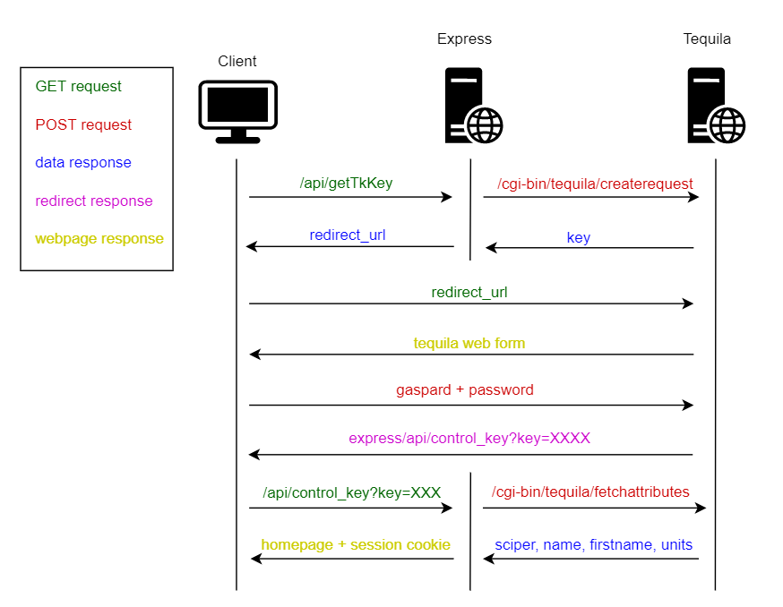
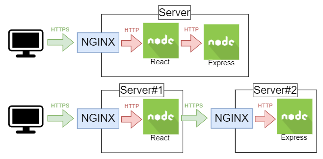

# Frontend API documentation

# General explanations

In this section, it is explained how the epxressJS backend server of the web application works in order to authenticate the users AND to sign the requests that are sent to DELA nodes (this part is described in the section dedicated to it).

## Proxying request
In order to avoid with the CORS policy, all the requests that goes to the DELA nodes and the to the Express server are "reverse proxied" by the react server. To do so the React middleware `http-proxy-middleware` with the following rules :
- All requests with an url beginning with `/evoting/*` are sent to the express server without url rewriting
- All requests with an url beginning with `/api/*` are sent to the express server without url rewriting

These configs are stored in the file `setupProxy.js` inside the react project.


## Authentication process
To vote the users are first authenticated with tequila (which is the internal authentication service at EPFL).
In order to use it some steps are required :
- First it is needed to recover a token from the tequila service : this token will be used by one user and is linked to a particular redirection user
- The user opens a webpage to the tequila authentication form and passes the key as a get parameter and enters username and password
- The tequila controls the credentials and if they are valid the user is redirected to our own servers (actually the request ends up on the express server) with another key as a get parameter
- This last key is then used by the express server to finally validate that the user request is valid and receive the user information from the tequila (sciper, lastname, firstname, etc...)
- If the previous request was valid, the express server logs the user in by setting in its session the sciper, the role, the first name and the name.

The following picture picture shows the different steps:

<p style="text-align:center"></p>

# Express endpoints

This part will talk about all the endpoints that are handled by the express server.

## Get the tequila key (API call)

This is via this endpoint that the client request the tequila key, this key will then be used for redirection on the tequila server

| | |
|-|-|
|URL|`/api/getTkKey`|
|Method|`GET`|
|Input|`nothing`|


Return:

`200 OK` `application/json`

```json
{
    "url": "<url of the tequila authentication form>"
}
```


## Control the tequila key (Not an API call)

Here the the client will send the key he/she receive from the tequila, it is then verified on the tequila.
If the key is valid, the user is then logged in the website through this request

| | |
|-|-|
|URL|`/api/control_key`|
|Method|`GET`|
|Input|`url parameters`|

The only parameter to give is the parameter automatically passed by the tequila which as follows :

`https://<host>/api/control_key?key=<tequila_key>`


Return:

`3xx Redirection`

Once controlled the user is redirected to the home page of the website (handled by React) and a session cookie is set to the user.


## Control the tequila key (Not an API call)

Here the the client will send the key he/she receive from the tequila, it is then verified on the tequila.
If the key is valid, the user is then logged in the website through this request

| | |
|-|-|
|URL|`/api/logout`|
|Method|`GET`|
|Input|`url parameters`|

The only parameter to give is the parameter automatically passed by the tequila which as follows :

`https://<host>/api/control_key?key=<tequila_key>`


Return:

`3xx Redirection`

Once controlled the user is redirected to the home page of the website (handled by React) and a session cookie is set to the user to authenticate it on the next requests.


## Logout (Not an API call)

This endpoint serves to logout from the app by clearing the session (cookie)

| | |
|-|-|
|URL|`/api/logout`|
|Method|`GET`|
|Input|`nothing`|


Return:

`3xx Redirection`

Once the session destroyed the user is redirected to the home page of the website (handled by React).


## Get the user information (API call)

This is via this endpoint that the client request the tequila key, this key will then be used for redirection on the tequila server

| | |
|-|-|
|URL|`/api/getTkKey`|
|Method|`GET`|
|Input|`nothing`|

The input is based on the session cookie, which gives then the right information corresponding to the current logged in user.

Return:

`200 OK` `application/json`

```json 
{
    "sciper" : <current user's sciper>,
    "lastname" : "<current user's last name>",
    "firstname" : "<current user's first name>",
    "role" : "<voter|operator|admin>",
    "islogged" : <true|false>
}
```

If islogged is set to false (which means that the user is not currently logged in) all the others return values are respectively set to 0 or ""


## Get the users role

This endpoint is used to get the list of users that have specials roles (i.e. operators and admins) and their corresponding roles.

| | |
|-|-|
|URL|`/api/get_user_rights`|
|Method|`GET`|
|Input|`nothing`|


Return:

`200 OK` `application/json`

```json
[
    {
    "id" : <DB id>,
    "sciper" : <user's sciper>,
    "role" : "<user's role>"
    }, 
    ...
]
```

## Add a role to a user
This allows to add new users to the list of the previous call.

| | |
|-|-|
|URL|`/api/add_role`|
|Method|`POST`|
|Input|`json`|

Input :
```json
{
    "sciper" : <user's sciper>,
    "role" : "<operator|admin>"
}
```


Return:

`200 OK` `application/json`


## Remove a role to a user
This allows to remove a user to the list of the previous call.

| | |
|-|-|
|URL|`/api/add_role`|
|Method|`POST`|
|Input|`json`|

Input :
```json
{
    "sciper" : <user's sciper>
}
```

Return:

`200 OK` `application/json`

## Create a node-proxy mapping
This endpoint is used to create a mapping between the address of a node and 
the address of a proxy.

| | |
|-|-|
|URL|`/api/proxies/`|
|Method|`POST`|
|Input|`application/json`|

```json

{
    "NodeAddr": "123.456.78.9:9000",
    "Proxy": "https://example.com/"
}

```

Return:

`200 OK` `text/plain`

```

```


## Get a node-proxy mapping
This endpoint is used to get the mapping of the address of a node and its associated proxy.  

| | |
|-|-|
|URL|`/api/proxies/{NodeAddr}`|
|Method|`GET`|
|Input||


Return:

`200 OK` `application/json`

```json

{
    "NodeAddr": "123.456.78.9:9000",
    "Proxy": "https://example.com/"
}

```

`NodeAddr` MUST be URL encoded. For example `123.456.9:9000` MUST become
`123.456.9%3A9000`. The native javascript functions `decodeURIComponent` and
`encodeURIComponent` can be used.

## Get all the node-proxy mappings

| | |
|-|-|
|URL|`/api/proxies/`|
|Method|`GET`|
|Input||

```json

{"Proxies": [
  {"123.456.78.9:9000": "https://example.com/"},
  {"111.222.333.444:9000": "https://blabla.ch/"}
]}

```

## Update a node-proxy mapping
| | |
|-|-|
|URL|`/api/proxies/{NodeAddr}`|
|Method|`PUT`|
|Input||

```json

{
    "Proxy": "https://blabla.ch/"
}

```

Return:

`200 OK` `text/plain`

```

```

`NodeAddr` MUST be URL encoded. For example `123.456.9:9000` MUST become
`123.456.9%3A9000`. The native javascript functions `decodeURIComponent` and
`encodeURIComponent` can be used.

## Delete the node-proxy address map
| | |
|-|-|
|URL|`/api/proxies/{NodeAddr}`|
|Method|`DELETE`|
|Input||


Return:

`200 OK` `text/plain`

```

```

`NodeAddr` MUST be URL encoded. For example `123.456.9:9000` MUST become
`123.456.9%3A9000`. The native javascript functions `decodeURIComponent` and
`encodeURIComponent` can be used.

## Get the default proxy address

|        |                 |
|--------|-----------------|
| URL    | `/config/proxy` |
| Method | `GET`           |
| Input  |                 |


Return:

`200 OK` `text/plain`

```
http://example.com/
```


# Production settings

The two followings things that will be shown here is how to have https on the different webpages and how to make the app run on a on server.

## HTTPS server
To have HTTPS on the server, one way to do this can be to install NGINX on the server and use it as a reverse proxy that handle the SSL connections and redirect them to the react or the express (especially if the express and the react are not on the same server). 
Here is a picture that explains quickly the idea (with express and react on same or separate server):
<p style="text-align:center"></p>

For that NGINX should be installed on the server and the following configuration should be applied (for instance in the default config file or in a new file located in `/etc/nginx/conf.d`)

```json
server {
    listen 443 ssl http2;
    server_name <hostname (fqdn)>;
    ssl_certificate <public key>;
    ssl_certificate_key <public key>;
    ssl_prefer_server_ciphers on;
    ssl_protocols TLSv1 TLSv1.1 TLSv1.2;
    ssl_session_timeout 1440m;

    location / {
        proxy_pass <localhost+port of the app>;
    }
    access_log  /var/log/nginx/dvoting.access.log  main;
    error_log /var/log/nginx/dvoting.error.log warn;
}
```

## Services files
The services files are the files that contains the information to run correctly the express and react processes on the server.

Those files must be located in `/etc/systemd/system/` and could be for instance be named `dvote-express.service` and `dvote-react.service`. Those file should look like this :


```
#!/bin/sh -
[Unit]
Description=<DVoting-Express|DVoting-React>

[Service]

WorkingDirectory=<app or backend folder location>
ExecStart=npm start

Restart=always

[Install]
WantedBy=multi-user.target
```

It now possible to do the following command : 
- `sudo systemctl start <file_name.service>` to start the app
- `sudo systemctl enable <file_name.service>` to automatically launch the processes when the server is rebooted

After that the files have been created/modified or after that the `sudo systemctl enable ...` command is ran, it would be good to be sure that the changes are taken in account to run `sudo systemctl daemon-reload`.

## Crond
It is recommended to restart periodically the two processes.
This can be done with crond. Once installed here are the following things to enable it :

- Type the command `crontab -e`, this will open a text editor.
- Add this line at the end of the file : `0 2 * * * sudo systemctl restart <dvoting-express.service>`
- Add this line at the end of the file : `0 2 * * * sudo systemctl restart <dvoting-reeact.service>`
- Save the file and exit

This will allow the services to be restarted once a day at 2 AM.