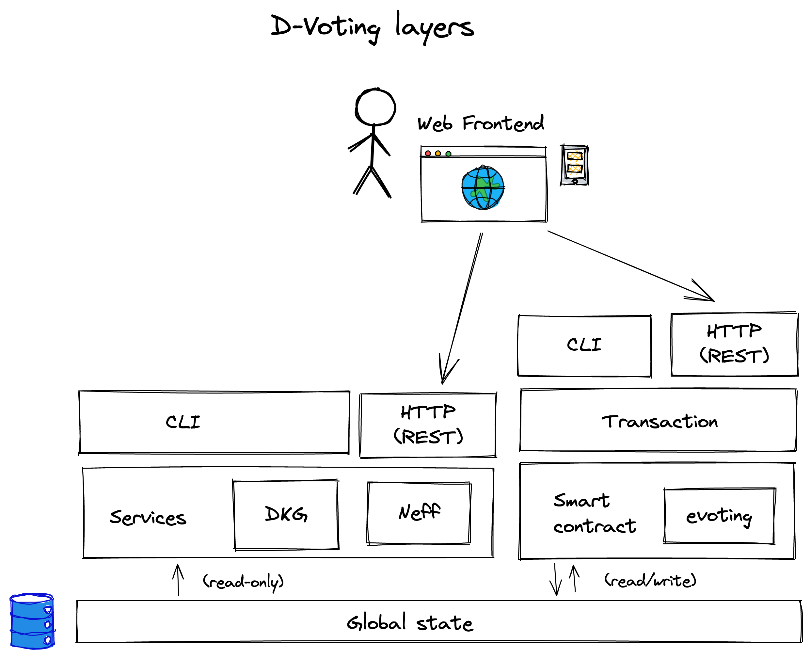

# D-Voting

## Deployment diagram

The following diagram pictures the d-voting system from a deployment point of
view. It describes the components and their interactions.

## Layers

The following layer diagram shows the layers of a node. It illustrates how an
end-user can interact with the system.

## Election flow

The following sequence diagram shows the entire flow of an election.

    
source

title Election flow

actor voter
actor admin
participant smart contract
database global state
database DKGRegistry

== Setup ==

admin->smart contract:OpenElection
smart contract->global state:GetRoster
global state-->smart contract:roster
smart contract->global state:StoreElection(roster, ...)
note over admin:electionID can be computed by the admin\nbased on the transaction ID that is unique
admin->DKGRegistry:init(electionID)
DKGRegistry->global state:GetElection
global state-->DKGRegistry:election.roster
DKGRegistry->DKGRegistry:dkg = create(roster)
DKGRegistry->DKGRegistry:store(dkg, electionID)
admin-->DKGRegistry:setup(electionID)

DKGRegistry->DKGRegistry:dkg = get(electionID)\npubkey = dkg.setup

== Open ==

admin->smart contract:open(electionID)
smart contract->DKGRegistry:GetPubKey(electionID)

DKGRegistry-->smart contract:pubkey
smart contract->global state:StoreElection(pubkey, ...)

== Cast ==

voter->global state:GetElection(electionID)
global state-->voter:election.pubkey

voter->voter:ballot = encrypt(vote, pubkey)
voter->smart contract:Cast(ballot)

smart contract->global state:StoreElection(ballot, ...)

== Shuffle election ==

admin->smart contract:CloseElection
smart contract->global state:StoreElection(status, ...)

admin->Neff:init
admin->Neff:setup(electionID)
Neff->global state:GetElection(electionID)
global state-->Neff:election.roster

Neff->smart contract:SubmitShuffle(shuffledBallots)\nuse the transactionID as the random source for the proof
smart contract->global state:StoreElection(shuffledBallots, ...)
smart contract->global state:(if enough shuffling)\nStoreElection(status, ...)

== Terminate ==

admin->smart contract:DecryptFragmentBallots
smart contract->DKGRegistry:Decrypt(electionID)

DKGRegistry->smart contract:SubmitPubShare(pubShare)

smart contract->global state:StoreElection(pubShare, ...)

admin->smart contract:Decrypt ballots
smart contract->global state:StoreElection(decryptedBallots, ...)

