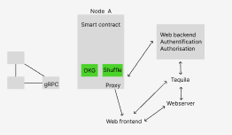

# Meeting 28/09/2022

## D-voting architecture

## Setup

Albert made a demo of the setup  with 3 nodes. 

<aside>
⚠️ run 3 nodes first otherwise it makes a mistake

</aside>

To be able to create an election we need to add ourself as an admin by modify our code  : 

In web > backend > src > Server.ts,

- return true in the function isAuthorized in line 178
- in line 164 modify the role to “admin”

We discover some possible bugs :

- bugs will creating an election (probably it’s a backend problem)
- will creating an election, refreshing the page causes the lost of all information