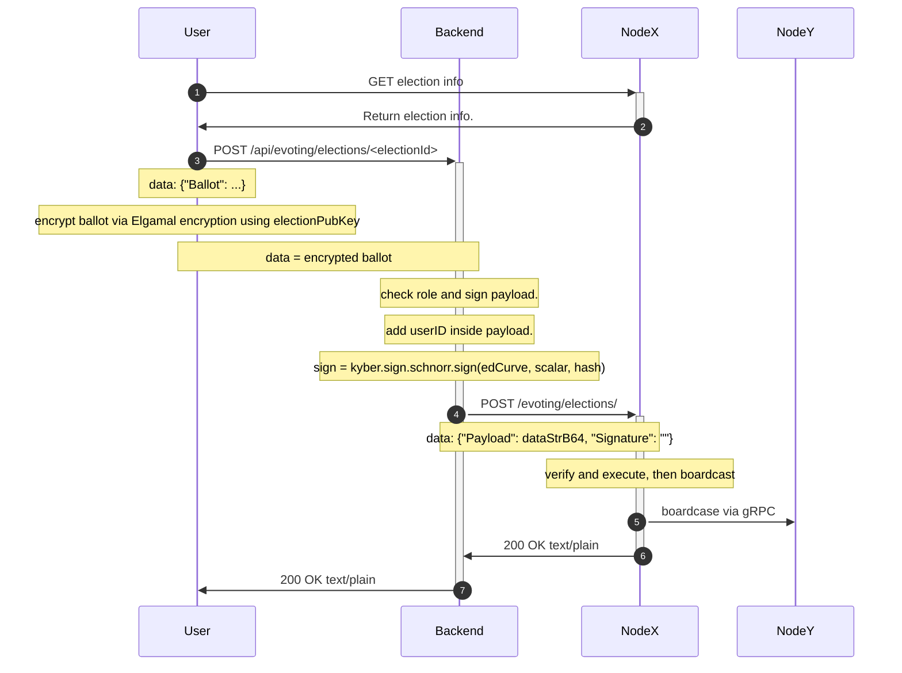
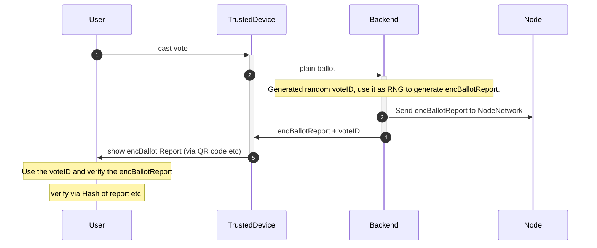
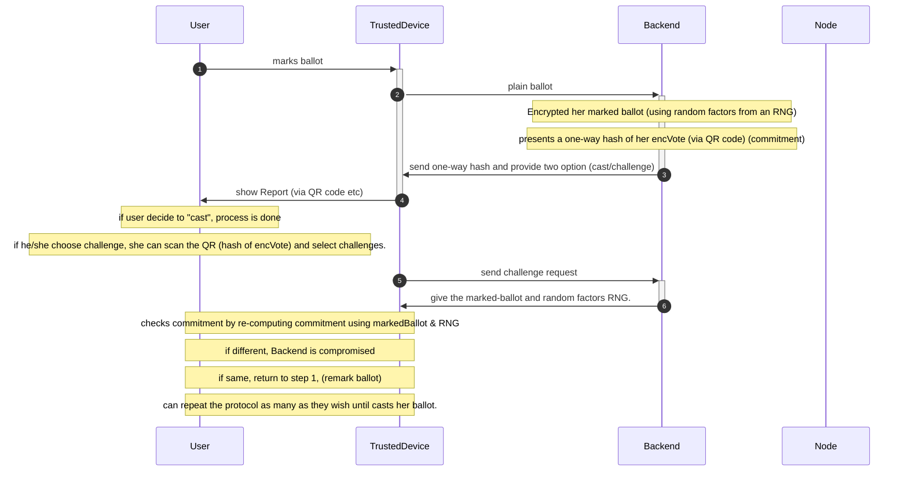
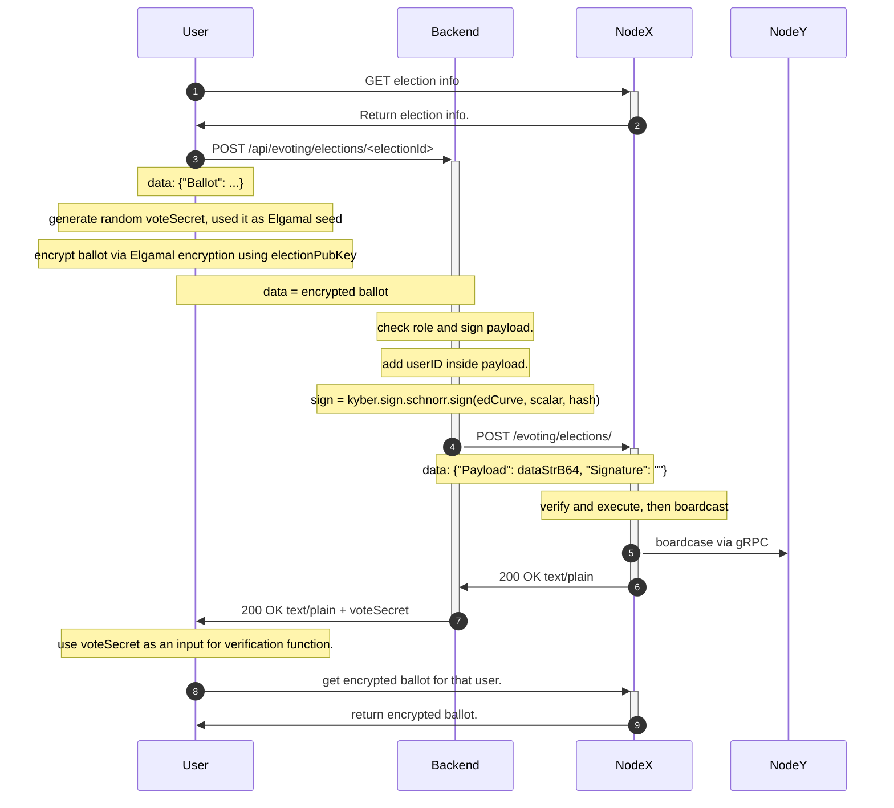

# vote verifiability

## Introduction
Verifiability is an important property to allows voters to check their vote has been cast unaltered, and that it has been registered correctly in the electronic ballot box.

The current d-voting (version num) didn't have this design yet. The current encrypted ballot logic is shown as follows:

As the picture show, the Frontend will encrypt the ballot using Elgamal encryption which has a nondeterministic result, and then sends it to the Backend to verify and sign. After that, the backend will send the encrypted + signed ballot to the blockchain node to put it on the chain. However, since the encryption is nondeterministic thus the user will not able to verify their casted ballot stored in the node.

In this document, we aim to design an implementation to achieve verifiability of the voters' encrypted vote without leaking ballot information to others.

## Requirements
The voter should able to verify their encrypted ballot in Frontend.
The encrypted vote remain confidentiality from others.
The Node shall have an endpoint to get voter encrypted ballot.

## Related work

### Strawman approach
The strawman design is just using a fixed seed to encrypt the ballot which make the encrypted ballot deterministic. Then the user can verify the encrypted ballot on the chain by just encrypt a new ballot with the same option.

However this design actually will break the confidentialy property of our d-voting system. An adversary be able to decrypt the user's ballot by recording the ciphertext of the encrypted ballot in every possible choice. Then the adversary can just check the ciphertext on the chain and will notify the voter ballot.

Thus we should keep some secret only to the voter himselves or the backend to prevent adversary unlock the ballot.

### Swiss POST evoting system
Swiss POST implement their own [evoting system](https://www.evoting.ch/en) which support the verifiability of the casted ballot.

Their protocol takes place between a User, a trusted device, and an untrusted device. In this example the user will be Alice, the trusted device will be her cellphone, and the untrucsted device will be the evoting backend system. After casting the vote, user will received a encBallotReport (via QR code). Then the user can verify if their vote has been cast correctly or not.

### Benaloh Challenge
[Benaloh Challenge](https://docs.rs/benaloh-challenge/latest/benaloh_challenge/) (also known as an Interactive Device Challenge), a crytographic technique to ensure the honesty of an untrusted device. While orignially conceived in the context of voting using an electronic device, it is useful for all untrusted computations that are deterministic with the exception of using an RNG. Most cryptography fits in this category.

This protocol takes place between a user, a trusted device, and an untrusted device. In this example the user will be Alice, the trusted device will be her cellphone, and the untrusted device will be a voting machine. The voting machine needs to do some untrusted computation using an RNG (encrypting Alice's vote), the details of which need to be kept secret from Alice so she can't prove to a 3rd party how she voted. However, the voting machine needs to assure Alice that it encrypted the vote correctly and didn't change her vote, without letting her know the secret random factors it used in it's encryption.

The voting machine must produce the commitment before it knows wether it will be challanged or not. If the voting machine tries to cheat (change the vote), it does not know if it will be challanged or if the vote will be cast before it must commit to the ciphertext of the encrytpted vote. This means that any attempt at cheating by the voting machine will have a chance of being caught.

In the context of an election, the Benaloh Challange ensues that systematic cheating by voting machines will be discoverd with a very high probability. Changing a few votes has a decent chance of going undetected, but every time the voting machine cheats, it risks being caught if misjudges when a user might choose to challenge.

## Proposed solution 1
When frontend encrypt the ballot, it randomly generate an voteSecret (UUID) for the ballot and then used it as a random seed as a parameter for the Elgamal Curve. After the vote been encrypted and send to backend, User will receive a message the voteSecret. The user later can use the voteSecret during the verification process to check if its vote has been casted correctly or not.

However, this design is still not perfect because it didn't have coercion resistance property because coercers will know the voteSecret during the vote. We can achieve coercion resistance via moved the encryption process to the backend and use benaloh challenge protocol to encrypt the vote. But currently our system didn't require coercion resistance thus we will not implement this.

### frontend
- Edit the submit vote function
    - generate a random voteSecret
        - can use either UUID or short UUID.
        - make sure to use cryptographically secure pseudorandom number generator library to generate this number
    - use the voteSecret as a random seed input to the encryption function.
    - show the voteSecret to user after the frontend send the request to the backend.
- Create a page for verify the ballot
    - A user can select the specific election they want to verify.
    - The user fill the election form and last input the voteSecret.
    - The frontend will create a ciphertext using the voteSecret and the ballot choice.
    - The frontend request the encrypted vote from the node and check if the encrypted vote is same as the ciphertext.
    - The frontend will show the compare result to the user.

### Blockchain node
- edit api "/evoting/forms/{formID}", add the hash of the ballot.

