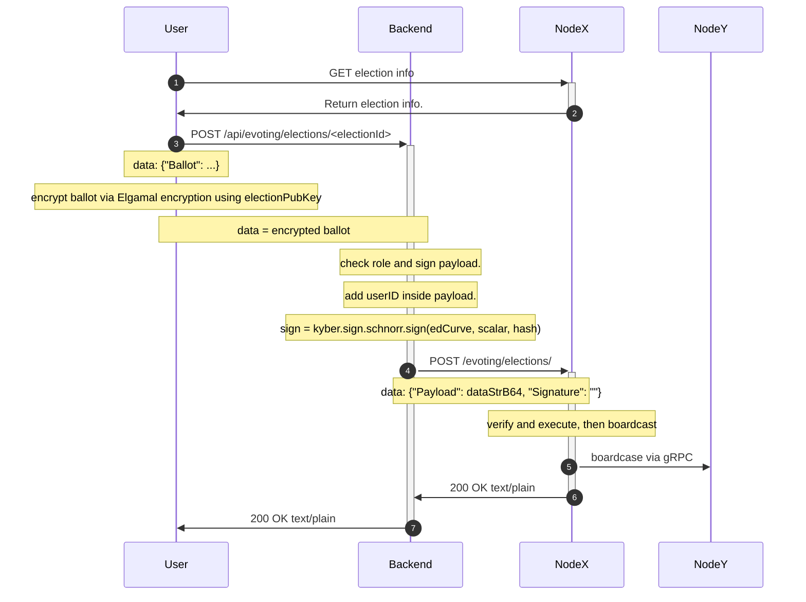
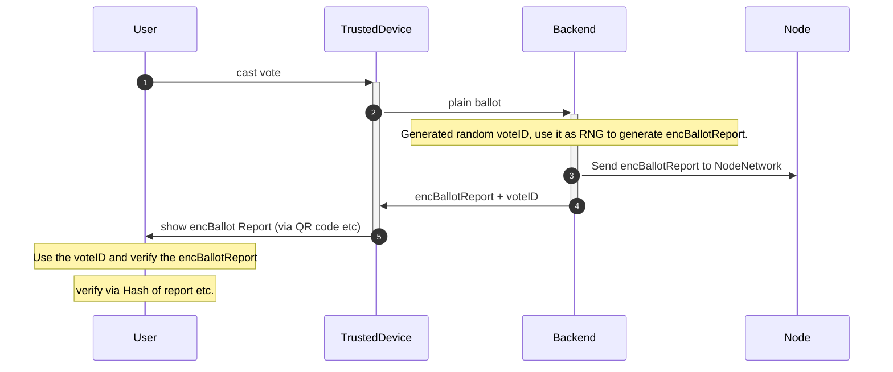
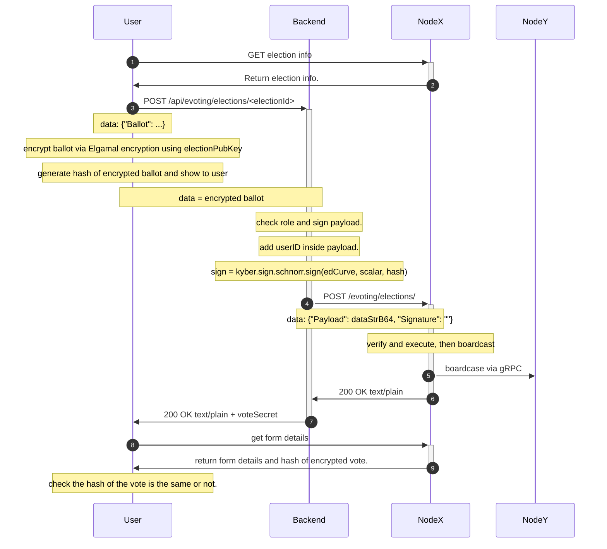
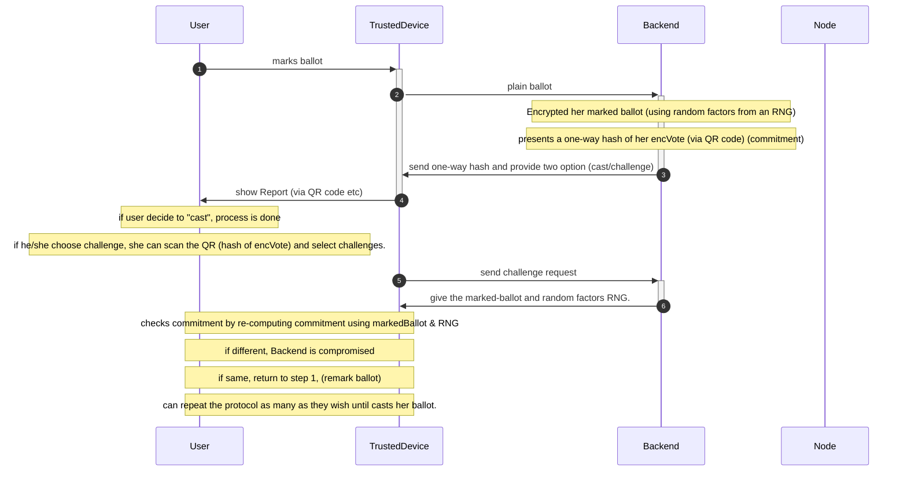

# vote verifiability

## Introduction

Verifiability is an important property that enables a voters to check their vote has been cast unaltered, and that it has been registered correctly in the electronic ballot box.

The current d-voting [latest commit](https://github.com/dedis/d-voting/commit/39a2d3363dd064a95186b0c31a44dfdea3325002) did not have this design yet. The current encrypted ballot logic is as follows:

As the picture shows, the frontend encrypts the ballot using Elgamal encryption which has a nondeterministic result and then sends it to the backend to verify and sign. After that, the backend sends the encrypted + signed ballot to the blockchain node to put it on the chain. However, since the encryption is nondeterministic thus the user will not be able to verify their casted ballot stored in the node.

In this document, we aim to design an implementation to achieve verifiability of the voters' encrypted vote without leaking ballot information to others.

## Requirements

The voter should be able to verify their encrypted ballot in the frontend.
The encrypted vote remains confidential from everyone except the voter.
The Node shall be able to show voters’ encrypted ballot.

## Related work

### Strawman approach

The strawman design is just using a fixed seed to encrypt the ballot which makes the encrypted ballot deterministic. Then the user can verify the encrypted ballot on the chain by just encrypting a new ballot with the same option.

However this design actually will break the confidentiality property of our d-voting system. An adversary is able to decrypt the user's ballot by recording the ciphertext of the encrypted ballot in every possible choice. Then the adversary can just check the ciphertext on the chain and will notify the voter ballot.

Thus we should keep some secret only to the voter themselves or the backend to prevent adversaries unlocking the ballot.

### Swiss POST evoting system

Swiss POST implement their own [e-voting system](https://www.evoting.ch/en) which support the verifiability of the casted ballot.

Their protocol takes place between a User, a trusted device, and an untrusted device. In this example the user will be Alice, the trusted device will be her cellphone, and the untrusted device will be the e-voting backend system. After casting the vote, user will receive a encBallotReport (via QR code). Then the user can verify if their vote has been cast correctly or not.

## Proposed solution

According to our requirements, we assume that the frontend is trusted. If the frontend is compromised, the adversary can already know the plaintext of the ballot which breaks the confidentiality of the ballot.

When the frontend after the frontend encrypted the ballot (use default non-deterministic encryption), it can hash the encrypted ballot and show the hash str of the encrypted ballot. The frontend sends the encrypted ballot to the backend.

A user can then check the hash of the vote by looking at the details of the form if the hash of the vote matches the one he received.

However, this design is still not perfect because it doesn't have a coercion resistance property. After all, coercers will know the Hash of the encrypted ballot during the vote. We can achieve coercion resistance by moving the encryption process to the backend and using the Benaloh challenge protocol to encrypt the vote. But currently, our system doesn't require coercion resistance thus we will not implement this.

### frontend

- Edit the submit vote function
    - hash the encrypted ballot and show it to the user.
- Edit the form details page to show the hash of the ballot.
    - A user can select an election to see the details.
    - In the detail page, it shows the voter and the hash of their ballot.
    - Users can check if the hash they received is the same as the hash on the details.

### Blockchain node

- edit api "/evoting/forms/{formID}", add the hash of the ballot to the form structure.

## Extension coercion protection

Here we proposed a solution to protect against coercion. However, this will not be implemented because it will need to change most of the current architecture. We will implement the Benaloh challenge in this design.

### Benaloh Challenge

[Benaloh Challenge](https://docs.rs/benaloh-challenge/latest/benaloh_challenge/) (also known as an Interactive Device Challenge), a crytographic technique to ensure the honesty of an untrusted device. While orignially conceived in the context of voting using an electronic device, it is useful for all untrusted computations that are deterministic with the exception of using an RNG. Most cryptography fits in this category.

This protocol takes place between a user, a trusted device, and an untrusted device. In this example the user will be Alice, the trusted device will be her cellphone, and the untrusted device will be a voting machine. The voting machine needs to do some untrusted computation using an RNG (encrypting Alice's vote), the details of which need to be kept secret from Alice so she can't prove to a 3rd party how she voted. However, the voting machine needs to assure Alice that it encrypted the vote correctly and didn't change her vote, without letting her know the secret random factors it used in it's encryption.

The voting machine must produce the commitment before it knows whether it will be challenged or not. If the voting machine tries to cheat (change the vote), it does not know if it will be challenged or if the vote will be cast before it must commit to the ciphertext of the encrypted vote. This means that any attempt at cheating by the voting machine will have a chance of being caught.

In the context of an election, the Benaloh Challenge ensues that systematic cheating by voting machines will be discovered with a very high probability. Changing a few votes has a decent chance of going undetected, but every time the voting machine cheats, it risks being caught if misjudges when a user might choose to challenge.

### Proposed solution

Just like the Benaloh challenge, a user can assume that the backend is untrusted, and they have a Benaloh challenge with the backend.

The user first encrypts their ballot using the election public key and then sends it to the backend. Then the backend encrypts the encrypted ballot again with a randomly generated seed and sends the hash of the enc(enc(ballot)) to the user.

Then the user can choose to challenge (which backend reveals the random seed) or accept (which backend executes the vote).

With this approach implemented, we are able to have coercion protection. However, the node will need to decrypt the ballot two times which requires changing the decryption process and increasing the execution time.
