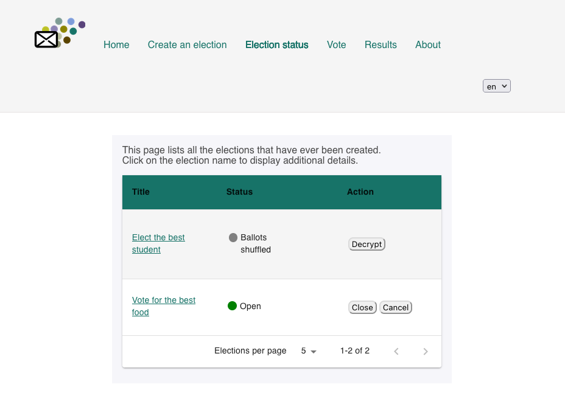

# Front-end of the DELA evoting system

This folder contains a front-end for admin and user operations.



It allows the user to create a new election, close/cancel it and also vote on on-going elections.
All the elections and their operations are saved on smart contracts from dela.
 
There is currently no real authentication mechanism, simply a login button that
gives an id and a token to a user. When a user cast a vote, his/her vote is
encrypted using the dkg public key of the nodes running the dela system. The
anonymity of a voter is not guaranteed, only the content of the vote meaning
that it is possible to know who voted. It needs to have Dela nodes running every
time you want to run the frontend web-application. The user interface uses
[React](https://reactjs.org/), a javascript library. You can find the
instruction about running a react-app in the app folder.
 
# Setup

For the front-end to work, you need to have 3 dela nodes running on your
computer. See instructions in `../README.md`.

First install dependencies (from ./app) with:

```
npm install
```

Then you can launch the app (from ./app) with:

```
npm start
```

# Dependencies

The project uses the following external libraries: 
* [dedis/cothority](https://github.com/dedis/cothority/tree/main/external/js/kyber)
  which is used for elliptic curve cryptography when encrypting a vote
* [mui-org/material-ui](https://github.com/mui-org/material-ui)
* [ReactTraining/react-router](https://github.com/ReactTraining/react-router)

# Running the tests

The unit tests can be found in src/components/_test_ folder. They can be run
with `npm run test`.
